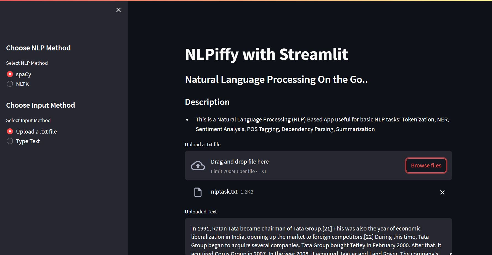
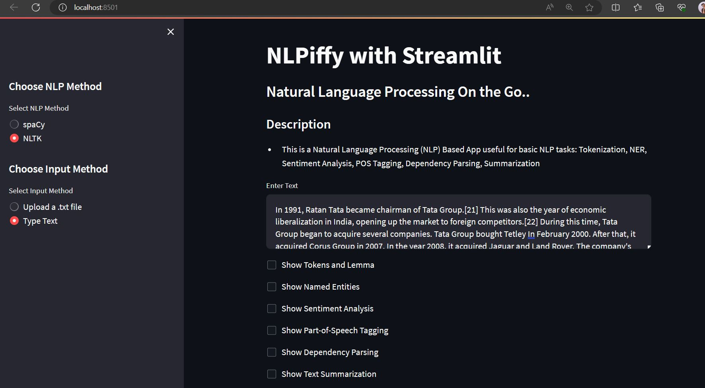

# NLPiffy: Natural Language Processing App with Streamlit

NLPiffy is a user-friendly web application built with Streamlit that offers a range of Natural Language Processing (NLP) functionalities. This app allows users to perform various NLP tasks such as Tokenization, Named Entity Recognition (NER), Sentiment Analysis, Part-of-Speech (POS) Tagging, Dependency Parsing, and Text Summarization.


## Features

- **Tokenization**: Analyze and display the tokens and lemmas of the input text.
- **Named Entity Recognition (NER)**: Extract and visualize named entities from the input text.
- **Sentiment Analysis**: Determine the sentiment (polarity and subjectivity) of the input text.
- **Part-of-Speech (POS) Tagging**: Identify and display the parts of speech of each token.
- **Dependency Parsing**: Visualize the syntactic dependencies between words in the input text.
- **Text Summarization**: Summarize the input text using the LexRank algorithm.

## Usage
Choose NLP Method:

Select between spaCy and NLTK for NLP processing.

1.Choose Input Method:

Upload a .txt file or enter text manually.

2.Select NLP Task:

3.Check the tasks you want to perform on the input text.

4.Analyze:

Click the buttons to perform the selected NLP tasks.

## Technologies Used
Streamlit: Interactive web application framework.
spaCy: NLP library for advanced natural language processing.
NLTK: Natural Language Toolkit for various NLP tasks.
TextBlob: Library for processing textual data.





## Getting Started

To get started with NLPiffy, follow these steps:

1. **Clone the repository**:

   ```bash
   git clone https://github.com/your-username/nlpiffy.git

2. **Install the required dependencies**:
   ```bash
   pip install -r requirements.txt

3.**Run the Streamlit app**:
  ```bash
    streamlit run NLPiffy.py

